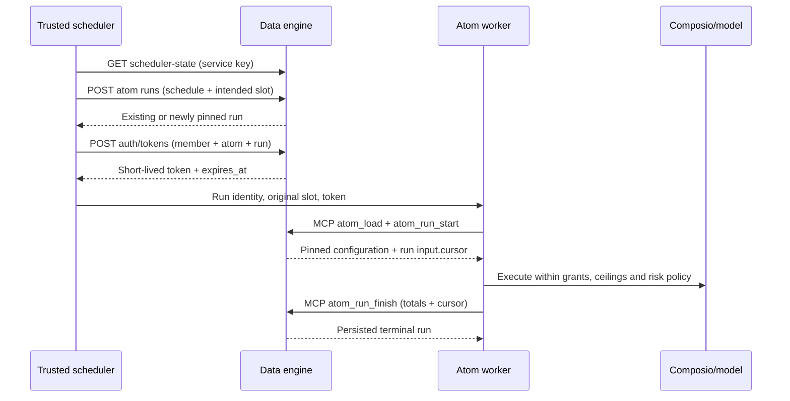

# Atoms: AI-engine integration guide

Audience: the AI-engine team implementing the scheduler, run worker and Composio adapter.
This describes the **current data-engine implementation**, not proposed endpoints.
For human administration and storage details, see [ATOMS_API.md](ATOMS_API.md).

## 1. Ownership and integration rules

| Data engine owns | AI engine owns |
| --- | --- |
| Atoms, immutable versions, schedules, cursors, run records | Schedule dispatch and cron/DST calculations |
| Live grants, owner visibility, restrictive RLS, run-token validation | Prompt composition, model execution and risk gate |
| Approval records, immutable payloads, expiry checks, claims/outcomes and assigned-human notifications | Approval UX, external execution and uncertain-effect reconciliation |
| Skill persistence/search and exact-version attachments | Selecting skills and reviewing community procedures |
| Connection configuration and failure reports | Composio direct-tool sessions, account connection UX and global throttling |
| Retry-safe final accounting and cursor updates | Accurate usage/action totals, external-effect idempotency and worker ownership |
| Safe SQL counts, groups and trends | Turning safe aggregate results into prose reports |

The AI engine needs **no direct PostgreSQL/vector-store access**. Do not store OAuth tokens
here. There are no atom event/webhook triggers. Monitoring is scheduled polling from a cursor.

Keep trusted control-plane requests separate from worker requests:

- **Scheduler:** `X-Data-API-Key` for discovery, bootstrap and token minting. Never expose this
  credential to the model or put it on worker resource requests.
- **Worker:** `Authorization: Bearer <run-token>` for MCP and granted REST resources. Never
  send both credentials: REST service-key authentication takes precedence over the bearer.
- **Human administration:** a human `atoms:admin` token, or the service key plus
  `X-Acting-Member-Id` identifying an authorized active human. This is not an atom capability.

## 2. Connection and transport

Base URL: the data engine, normally `http://localhost:8002` locally. Use HTTPS in deployment.
REST schema is available at `/openapi.json`; interactive docs at `/docs`.

Before integrating, deploy with `DATA_API_KEY` and `MEMORY_TOKEN_SECRET` configured. The AI
engine receives only the service key in its trusted controller; the signing secret stays in the
data engine. Follow the [installation requirements](ATOMS_API.md#installation-and-verification):
PostgreSQL 15+, atom SQL helpers/invariants and a nonowner, nonsuperuser, NOBYPASSRLS runtime role.
For an existing legacy database, take a backup, then run
`python -m app.db.upgrade_atoms --app-role flwn_app` with `DATABASE_ADMIN_URL` before app rollout.
There is no fallback to `DATABASE_URL`; `--app-role` must match that runtime connection's role.
The additive, transactional, idempotent upgrade uses bounded locks and preserves rows and the
existing runtime-role login/password. Never use `--reset` on an existing database; `create_all`
does not upgrade it. An old-image rollback leaves the additive schema in place.

MCP endpoint: **`/mcp`**, Streamable HTTP, stateless, JSON responses. Use the existing MCP
client/pooled session, initialize it normally, and discover schemas with `tools/list`.
Requests should accept `application/json, text/event-stream`.

Partition pooled authenticated clients by run identity/token. Never mutate a shared default
Authorization header across concurrent runs. On token refresh, rebind/recreate the authenticated
client without changing workspace, atom or run identity.

**Do not add `workspace_id`, `atom_id`, `run_id` or `member_id` to atom-tool arguments.**
Their identity comes from the signed bearer token. REST workspace routes still require the
matching workspace UUID in the URL. Carry workspace/run identity in adapter context and logs,
not invented MCP arguments. Do not log tokens or unrestricted request/response content.

## 3. Required execution sequence



### A. Discover schedules

Service-key-only request:

```http
GET /workspaces/<workspace-id>/atoms/scheduler-state?status=active&enabled=true
X-Data-API-Key: <service-key>
```

Returns an array of atom objects with `version`, `grants`, `schedules` and `connections`.
It is **not a due-work queue**. The optional filters above select active atoms with an enabled
schedule and include only matching schedules. Without filters, drafts and paused/killed atoms
and all schedules are included. Deleted atoms are always omitted.

Schedule fields include `id`, `atom_id`, `cron`, `interval_minutes`, `timezone`, `next_run_at`,
`last_run_at` and `cursor`. Exactly one cadence is configured. Intervals are at least five minutes.
Cron validation accepts numeric five-field expressions; do not assume named weekdays/months or macros.

Compute the intended scheduled slot, not delivery time. Apply the schedule's timezone for cron;
use timezone-aware timestamps on the wire. A null `next_run_at` is not a computed due time—the
scheduler must establish its initial slot. The agreed ACA scheduler polls every minute and runs
**only the latest due slot**; cursor-based atoms catch up from their persisted cursor. The AI
engine owns DST behavior. Do not dispatch every poll using a fresh timestamp.

Before bootstrap, release abandoned runs through the service-only endpoint:

```http
POST /workspaces/<workspace-id>/atoms/<atom-id>/runs/release-stale
X-Data-API-Key: <service-key>
Content-Type: application/json
```

```json
{"older_than_seconds": 900}
```

Returns `{"released_run_ids": [...]}`. Required age is an integer 900–31,536,000 seconds;
choose an age safely beyond the worker's execution cap. Only older `running` rows become
`failed`, with `ended_at` and existing output plus `"_released": "stale"`. Recorded totals,
usage ledger and cursor/schedule timestamps are unchanged. Terminal rows and repeated calls
are untouched. This explicit recovery endpoint is preferred over heartbeats for v1.
It does not cancel an external call already dispatched, clear approval claims, or recreate a
failed run for the same slot. A different, latest due slot can bootstrap afterward.

### B. Bootstrap a run before minting its token

```http
POST /workspaces/<workspace-id>/atoms/<atom-id>/runs
X-Data-API-Key: <service-key>
Content-Type: application/json
```

Example body (replace UUID placeholders and use an intended slot that is due):

```json
{
  "schedule_id": "<schedule-id>",
  "scheduled_for": "2026-10-10T09:00:00Z",
  "idempotency_key": "daily-monitor:2026-10-10T09:00:00Z",
  "estimated_cost": "0.020000",
  "estimated_actions": 2
}
```

`idempotency_key` is required by the REST/MCP request contract but does **not** override server
uniqueness. The server derives its key from **atom ID + normalized UTC slot**. Keep the same
slot on delivery retries. Changing only the client key still returns the same run. Two schedules
on the same atom at the same instant share this key;
compare the returned `schedule_id` and do not launch a second execution.

The response is a run object. These are the worker-relevant fields; additional fields exist:

```json
{
  "id": "<run-id>",
  "workspace_id": "<workspace-id>",
  "agent_id": "<atom-member-id>",
  "atom_id": "<atom-id>",
  "atom_version_id": "<version-id>",
  "schedule_id": "<schedule-id>",
  "trigger": "schedule",
  "status": "running",
  "input": {
    "scheduled_slot": "2026-10-10T09:00:00+00:00",
    "cursor": {},
    "estimated_cost": "0.020000",
    "estimated_actions": 2
  },
  "tokens_in": 0,
  "tokens_out": 0,
  "cost": "0.000000"
}
```

A duplicate bootstrap returns the stored run, including its current status. If already terminal,
do not execute it again or try to mint a fresh runtime token. A `running` response alone does
not prove that this worker owns execution: both duplicate deliveries can receive the same row.
Ensure a single execution owner in the scheduler/job system. The API does not issue a worker lease.

New runs reject inactive atoms, disabled/not-due/future slots, another in-flight invocation and
exhausted daily caps. Zero caps mean no capacity, not unlimited. Budgets use the UTC day of actual
run start, not the scheduled slot's local date. Supply realistic estimates. Estimates and admission
checks do not interrupt external work; enforce the remaining cost/action budget in the worker too.

### C. Mint a least-privilege token

```http
POST /auth/tokens
X-Data-API-Key: <service-key>
Content-Type: application/json
```

```json
{
  "workspace_id": "<workspace-id>",
  "member_id": "<atom-member-id>",
  "atom_id": "<atom-id>",
  "run_id": "<run-id>",
  "subject": "atom-worker",
  "ttl_seconds": 900,
  "scopes": ["atoms:read", "atoms:run", "aggregate:read"]
}
```

Response: `{"token": "<signed-token>", "expires_at": <Unix-seconds>}`. Atom TTL defaults to 900
seconds and cannot exceed 900 or the configured global token maximum. All four identity fields
must refer to the same live workspace/member/atom/run. Unbound regular tokens for atom members
are rejected. Atom tokens can never include `atoms:admin`.

Always supply scopes explicitly. Defaults are only `memory:read` and `files:read`, not atom scopes.
V1 workers are capped below the token's lifetime, so no refresh is required. A replacement
minted for the **same live run** is accepted while the first is still valid; neither revokes the
other. Both recheck live state. Refresh cannot bypass revocation, killed/deleted or terminal state.

### D. Load and resume

Call `atom_load` with `{}` and `atom_run_start` with the original schedule, slot and delivery key.
The MCP start is a **resume/check of the already token-bound run**, not another bootstrap.

`atom_load` returns a **flat atom object**, not `{"atom": ...}`. Its top-level fields include
`id`, `member_id`, `kind`, `owner_member_id`, `status`, `model_tier`, `active_version_id` and caps,
plus:

- `version`: the run-pinned version, with `id`, `version`, `instructions`, `policy`, `tools`,
  `source`, `status` and `eval`. Use this payload even if `active_version_id` has since changed.
- `grants`: current grants, including resource_type/resource_id/level/constraints.
- `schedules`: current schedule configuration and cursors.
- `connections`: explicit Composio identity, pinned version, ceiling, allowed slugs and health.
- `skills`: enabled exact-version skill metadata **and instructions**. Deleted/inaccessible
  skills are filtered. A remaining attachment with incompatible connection permissions can
  make load fail; do not bypass the check or silently widen tools.

Use **`run.input.cursor`** from bootstrap/resume as the current invocation's starting watermark.
The load payload is not authorization cached for the whole run: data calls recheck live grants,
and the AI engine must keep its external tool session consistent with current connection settings.

### E. Finish once; retry the same finish on transport uncertainty

```json
{
  "status": "succeeded",
  "output": {"report": "Processed the new items."},
  "tokens_in": 1500,
  "tokens_out": 200,
  "cost": "0.018000",
  "actions_count": 2,
  "cursor": {"last_processed_id": "external-watermark"}
}
```

Send this as `atom_run_finish` arguments. No run ID argument is accepted.

- Status is `succeeded`, `failed` or `canceled` (one l).
- Counts and cost are nonnegative **cumulative totals**, not deltas. Cost must be a decimal
  **JSON string** like `"0.018000"` (1–6 integer digits; optional 1–6 fractional digits).
  JSON numbers/floats, negatives, exponents, NaN and infinity are rejected by the MCP schema.
- Output must be an object. Keys beginning with `_` are reserved and rejected.
- Optional `model` (nonblank, at most 200 characters) is recorded on the run and reconciled
  usage row. There is no `error` argument; put a safe failure description inside `output`.
- Only successful completion advances the schedule cursor and `last_run_at`; failures/cancellations
  leave the cursor unchanged. Older slots cannot move it backward. Success updates interval
  `next_run_at`; computing the next cron slot remains scheduler work.
- Terminal finish retries return the stored result without changing totals/output/cursor.
  Changed retry arguments do not amend the first result. Finish and approval get/claim/outcome
  permit terminal retries with a still-valid token; other terminal tools are denied. Terminal
  approval claims cannot grant fresh execution permission.
- Run totals and `llm_usage` represent the same spend. Finish reconciles existing ledger rows;
  never add both views together when reporting cost.

Persist/reconcile delivery state in the orchestrator. If the finish response is lost and the token
expires, a trusted repeat bootstrap can help inspect the existing run. Do not start a new slot
just to retry uncertain external effects. Use the service-only `runs/release-stale` endpoint
for abandoned running rows, then consider the latest due slot. It preserves recorded usage
and cannot undo or safely repeat an uncertain external effect.

## 4. MCP adapter contract

Required arguments appear before the semicolon; arguments after it are optional defaults.
All tools use identity from the token.

| Tool | Scope | Arguments | Result |
| --- | --- | --- | --- |
| `atom_load` | `atoms:read` | None | Flat atom configuration described above |
| `atom_run_start` | `atoms:run` | schedule_id, scheduled_for, idempotency_key | Bound run with input.cursor |
| `atom_run_finish` | `atoms:run` | status; output=null, tokens_in=0, tokens_out=0, cost="0", cursor=null, actions_count=0, model=null | Persisted terminal run |
| `atom_propose_version` | `atoms:propose` | instructions; policy=null, tools=null | New candidate, source=self; not activated |
| `atom_approval_create` | `atoms:run` | title, payload; request_key=null, kind="atom_action", assigned_to=null, expires_at=null | Idempotent parked approval |
| `atom_approval_get` | `atoms:run` | approval_id | Stored approval, including status/expiry/outcome |
| `atom_approval_claim` | `atoms:run` | approval_id | execute boolean plus approval record |
| `atom_approval_outcome` | `atoms:run` | approval_id, status; result=null | First stored outcome; status succeeded/failed/unknown |
| `skills_search` | `skills:read` | query; limit=5 (1–50) | Object containing skills array |
| `skill_write` | `skills:write` | name, description, when_to_use, instructions, scope; version=1, tools_required=null | Skill metadata with instructions |
| `skill_attach` | `skills:write` | skill_id, skill_version; catalog=false | Attachment metadata |
| `atom_connection_report` | `atoms:run` | connection_id, status; detail=null (max 2000 chars) | Updated connection |
| `aggregate_read` | `aggregate:read` + live grant | resource_type; resource_id=null, group_by=null, trend=null | count, optional groups/trend |

For `tools/list` schemas, `ctx` is injected by the server, not a client argument. Null policy/tools
on proposal become `{}`/`[]`; null tools_required becomes `[]`. Other existing MCP resource tools
retain their existing names/arguments, with live atom grant checks applied.

A wire request, after normal MCP initialization:

```json
{
  "jsonrpc": "2.0",
  "id": 7,
  "method": "tools/call",
  "params": {"name": "atom_load", "arguments": {}}
}
```

Decode the **MCP envelope**, not just HTTP status:

1. Handle HTTP/transport and JSON-RPC `error` failures first.
2. Check `result.isError`; HTTP 200 can still contain a failed tool call.
3. On success, use `result.structuredContent` when present. Otherwise decode the returned JSON
   text content. Existing clients/tests support both representations.
4. Never parse failed tool text as a successful resource. Use the stable atom-domain prefixes
   in section 7 where present, never match explanatory sentences. Other envelopes remain unchanged.

### 4.1 Park, approve, then execute in a later run

Full REST paths, field limits and human decision rules are in
[the approval API contract](ATOMS_API.md#parked-action-approvals). Worker tools use only their
run token; the service key stays with trusted control-plane code.

1. When the risk gate requires approval, call `atom_approval_create`:

   ```json
   {
     "title": "Send the reviewed report",
     "kind": "atom_action",
     "payload": {
       "tool_slug": "OUTLOOK_SEND",
       "arguments": {"subject": "Daily report"},
       "connection_id": "<connection-id>"
     },
     "request_key": "report:2026-10-10",
     "assigned_to": "<human-member-id>",
     "expires_at": "2026-10-11T09:00:00Z"
   }
   ```

   Payload accepts exactly tool_slug, arguments and connection_id. Caller/run/requester identity
   is derived from the token. Omitted request_key uses a content hash scoped to this run; an
   identical retry returns the original row. Data engine creates the assigned-human notification
   transactionally, once. Do not create a duplicate notification. Finish the proposing run with
   normal cumulative usage; never wait for the human while holding an in-flight run.
2. The human decision is submitted through trusted code using
   `PUT /workspaces/{workspace_id}/approvals/{approval_id}/decision`, service key plus acting
   human, body `{"status":"approved","comment":"Reviewed"}` (or rejected). Approved payloads
   are immutable. Same decision is a no-op while authorization/expiry remain valid.
3. Scheduler queries service-only `GET /workspaces/{workspace_id}/approvals/ready?limit=100`.
   It returns a bare array, oldest creation first, then id; limit 1–200. Only approved, unexpired
   rows without an execution run appear. There is no cursor/offset; bootstrap removes selected
   rows from this list, so repeated queries drain later batches.
4. Scheduler calls service-only
   `POST /workspaces/{workspace_id}/approvals/{approval_id}/execution-run` with
   `{"estimated_cost":"0","estimated_actions":1}`. This is idempotent per approval and shares
   normal budgets/one-in-flight admission. Finish the proposing run first. The dedicated run
   has `schedule_id=null`, `trigger="schedule"` for compatibility, and key `approval:<id>`.
   Its immutable input includes approval_id and approval_payload. It does not advance a schedule
   cursor. Mint a token bound to this run through `/auth/tokens`, then dispatch the run input
   and token. Do not call `atom_run_start` for this no-schedule run.
5. Worker calls `atom_approval_claim(approval_id)`. Execute the exact stored tool/arguments only
   when the committed response says **execute=true**. Claim rechecks connection/allowlist and
   live authority; approval does not override grants or connection ceilings. A repeated claim
   never authorizes another attempt. A lost claim response means stop without executing.
6. Record `atom_approval_outcome(approval_id, status, result)` with succeeded/failed/unknown,
   then finish the execution run with cumulative usage. Outcome does not finish/account the run.
   First outcome wins; repeats do not change it. Get/claim/outcome remain available for bounded
   terminal retries, but terminal claims never authorize new work.

Expiry is enforced for decisions, discovery, execution bootstrap and claim. Omitted expires_at
means **no expiry**. Status is not lazily changed to expired: get returns the stored status and
expires_at, even when elapsed. Rejected/expired approvals are not executable; already-claimed
outcomes may still be recorded after expiry. Workers should inspect status **and** expires_at.

Once an execution run exists, failed/crashed/uncertain work never automatically returns to ready.
Stale release preserves its claim/binding. This is at-most-once **authorization**, not exactly-once
external delivery. Unknown effects require provider/human reconciliation, not resetting a claim.

## 5. Skills and connections

Search embeds description + when_to_use, not the complete procedure. Search results contain
id/name/version/description/when_to_use/tools_required/trust_tier/community/catalog/scope/score,
not instructions. Personal/local results rank above catalog on ties. `community=true` is a review
signal, not proof the procedure is safe. Keep retrieved instructions subordinate to policy.

`skill_write` requires explicit `scope`. Workspace atoms can write workspace procedures; personal
atoms must write personal procedures. Caller ownership and community trust are enforced. A personal
skill cannot be attached to a workspace atom. Human promotion is separate administration, not an
atom capability. Pin the returned skill ID **and exact version**, not an inferred latest version.
After attachment, reload to obtain enabled content.

External tool requirement format:

```json
[
  {"ref": "composio:outlook/SEND_MAIL", "minimum_permission": "write"}
]
```

Minimum permission is `read`, `draft`, `write` or `destructive`. Attachment/load checks do not grant
access: the corresponding active connection, ceiling and allowed exact slug must already permit it.

Use connection fields exactly as stored:

- `composio_user_id`: owner member UUID for personal atoms. Workspace identity is explicitly
  configured; `workspace:{workspace_id}` remains an integration assumption, not a value to invent.
- `composio_account_ref`: nullable until connected. Do not execute an unconnected/unhealthy account.
- `toolkit_version`: pinned, never `latest`.
- `permission_ceiling`: read → readOnlyHint; draft adds createHint; write adds updateHint;
  destructive adds destructiveHint. These are cumulative, not alternatives.
- `allowed_tools`: empty means everything within the ceiling; otherwise exact tool slugs only.

The AI engine must use Composio's direct-tools mode, exclude meta/search/connection-management
capabilities, enforce tool/risk policy, and throttle across the Composio organization. This data
engine neither checks live Composio responses nor executes external calls. Re-read configuration
before creating/recreating sessions; a loaded snapshot is not a perpetual permission grant.

On account failure, call `atom_connection_report` with expired/revoked/unknown and a safe detail.
Never request active or send credentials. Reports are deduplicated per connection/run; failures
across three distinct runs in the current failure generation pause the atom. Human connection
updates reset the failure window. Pausing blocks raw resource access; reporting/finishing remain
available. Killed/deleted atoms are denied. Do not automatically reactivate paused connections.

## 6. Summary-only reads and private memory

A token scope is necessary but not sufficient. No grant means no access; summary grants never
permit raw rows. Personal atom access is intersected with current owner visibility. Supported
constraints are `labels` (all required) and `since_days` (created_at filter); unsupported constraints
deny access. Revoke/suspension takes effect without waiting for token expiry.

Aggregate resource semantics and permitted groupings:

| resource_type | Rows counted / resource_id identifies | group_by values |
| --- | --- | --- |
| project | Tasks / project | status, priority |
| team | Projects / team | status |
| collection | Docs / collection | is_template, is_locked |
| channel | Messages / channel | kind |
| folder | Files / folder | kind, status |
| memory | Memories / memory | kind, scope, status |
| meeting | Meetings / meeting | status |
| connection | Atom connections / connection | status, permission_ceiling |

Omitting resource_id aggregates over the applicable grants, not the unrestricted workspace.
`trend` accepts day/week/month and buckets **created_at in UTC**, not event or completion time.
Periods are ISO timestamps in UTC (the serialized bucket strings may omit the offset).

Example arguments and illustrative response:

```json
{"resource_type": "project", "resource_id": "<project-id>", "group_by": "status", "trend": "day"}
```

```json
{
  "count": 2,
  "groups": [{"value": "todo", "count": 2}],
  "trend": [{"period": "2026-10-10T00:00:00", "count": 2}]
}
```

No identifiers, titles, bodies or model-written `summary` field are returned. Generate prose from
these safe values in the AI engine. A server-generated prose-summary API is **not implemented**;
do not depend on one or fall back to raw reads after a summary-only denial.

For private learning, existing memory tools require their normal scopes **and** an applicable live
write grant. Writes force agent scope and owner/author to the atom member. Deduplication cannot
modify shared/read-only memories. Having an owner with broad visibility does not create a grant.

## 7. Failure and retry rules

| Failure | Adapter behavior |
| --- | --- |
| REST 401 / invalid or expired MCP token | Refresh through trusted controller only if the same run is still live; otherwise stop |
| REST 403 / MCP permission failure | Stop denied work; do not retry with a service key or broader scopes |
| REST 404 | Treat as unavailable/deleted/inaccessible; do not probe another workspace |
| REST 422 | Fix request/state/admission issue; not a generic transient retry (caps/not-due/busy can use this status) |
| Transport timeout / transient 5xx | Bounded backoff; preserve original slot and finish totals; inspect returned run status |
| Skill load/attachment ceiling failure | Human configuration or permitted skill selection must resolve it; never expand permission automatically |
| Unknown external effect outcome | Reconcile with provider idempotency/status before retrying; run idempotency is not external exactly-once execution |

**Approval claims are an exception to generic transport retries.** A one-time claim grants
execution only once. If its response is lost, fail closed: do not execute without confirmation
or treat a repeated claim as fresh permission. Claimed or failed execution runs never
automatically requeue. Stale-parent release must preserve the approval's
`execution_run_id` and `claimed_at`. External exactly-once execution cannot be guaranteed;
reconcile uncertain effects with the provider rather than clearing the claim and trying again.

Atom domain failures use stable prefixes inside REST `detail` or MCP error text (the SDK may
wrap the text in `Error executing tool ...`). Match the prefix, not the explanatory sentence:

| Prefix | Meaning / retry policy |
| --- | --- |
| `denied:` | Credential/scope/live authorization rejected; stop |
| `not_found:` | Atom-domain resource unavailable; stop |
| `invalid:` | Fix domain input |
| `invalid_state:` | Requires state/configuration change; not a transport retry |
| `not_due:` | Recompute/select a due slot |
| `busy:` | Another invocation is in flight; wait or release only if genuinely stale |
| `cap_exhausted:` | Wait for capacity/reset or an authorized cap change |

FastAPI 422 request-schema errors retain their structured detail list; MCP schema validation
and older non-atom tool errors retain their SDK/legacy envelopes. Do not treat every 422 as
transient. Keep logs tied to workspace_id/atom_id/run_id/schedule_id and original slot while
redacting credentials and unnecessary private data.

## 8. AI-engine acceptance checklist

- [ ] All atom tools map to their actual names and arguments; no invented identity parameters.
- [ ] Finish sends decimal strings (numeric JSON is rejected) and optional model metadata.
- [ ] Same-slot bootstrap with different client keys returns one run; overlapping live tokens work.
- [ ] Scheduler filters, stable domain error prefixes and stale release are handled explicitly.
- [ ] Service-key client and per-run MCP clients are isolated, including refresh and concurrency.
- [ ] Duplicate delivery uses the original slot and has one execution owner; terminal runs are skipped.
- [ ] Worker uses version payload and run.input.cursor, not the mutable active pointer/latest cursor.
- [ ] Finish retries preserve totals and cursor; failure/cancellation does not advance the watermark.
- [ ] Same-token revocation, owner suspension and cross-workspace denial stop resource access.
- [ ] Summary-only reporting uses safe aggregates; no raw fallback or expected server prose field.
- [ ] Personal/workspace skills, community review, exact pins and connection ceiling failures are covered.
- [ ] Composio sessions use explicit identity/account/version, cumulative tags and exact allowed slugs.
- [ ] Connection reports cannot reactivate; repeated distinct failures pause safely.
- [ ] Daily budget, one-in-flight rejection, token expiry and abandoned-worker recovery have explicit handling.
- [ ] Approval creation retries preserve exact payload/requester and produce one assigned-human notification.
- [ ] Rejected/expired work is excluded; execution input is immutable and claims recheck live authority.
- [ ] Lost approval-claim responses fail closed; stale-parent release preserves claims and never auto-requeues execution.
- [ ] Approval outcome retries preserve the first result; finishing separately accounts for execution usage.

Approval lifecycle and concurrency proof: [service tests](../tests/test_atom_approvals.py) and
[REST/MCP tests](../tests/test_atom_approvals_api.py).

Data-engine reference tests: [REST/MCP integration](../tests/test_atoms_api.py),
[lifecycle/accounting](../tests/test_atoms_service.py), [tokens](../tests/test_atom_tokens.py),
[live access](../tests/test_atom_access.py) and [skills/aggregates](../tests/test_atom_skills_aggregate.py).
This guide does not implement or validate the AI-engine adapter, Composio behavior or a production migration.
